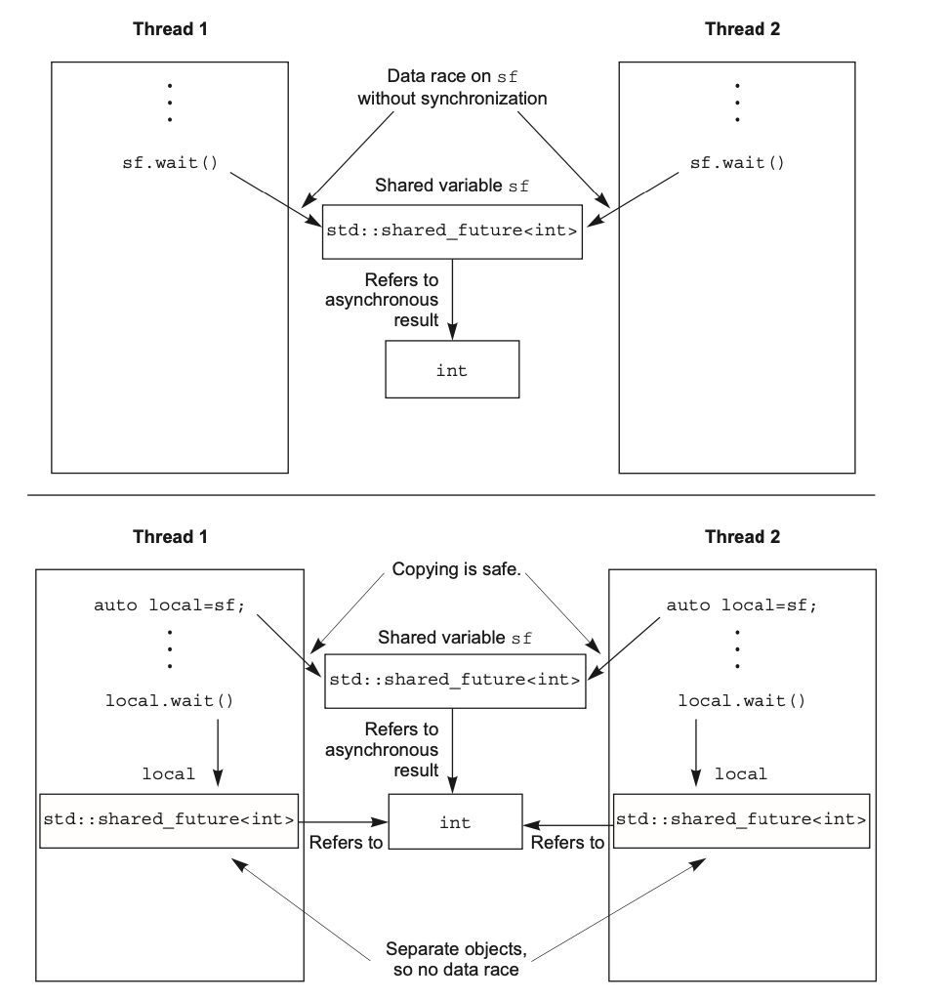
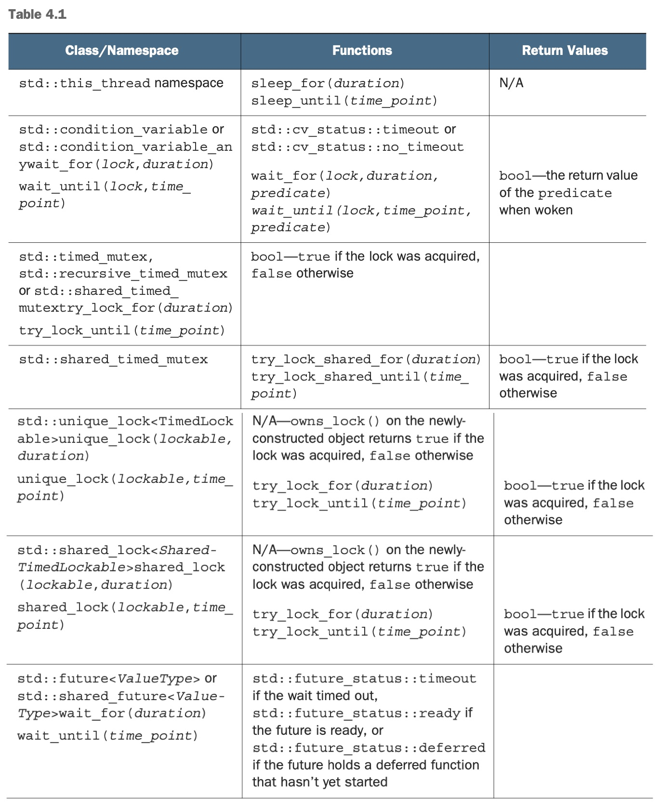

### Synchronizing Concurrent Operations

**Overall**
- Waiting for an event
- Waiting for one-off event with futures
- Waiting with a time limit
- Using the synchronization of operations to simplify code

--- 

Sometimes not only do we need to protect shared data between threads, but also to synchronize actions on separate threads. C++ Standard Library provides support for this in term of ***condition_variable*** and ***future***. In Concurrency Technical Specification(**TS**), there are additional supports in form of ***latches*** and ***barriers***.

#### Waiting for an event or other condition

Instead of busy looping which consumes a lot of CPU cycles, C++ Standard Library provides **std::condition_variable** that allows threads to wait and notify based on a predicate/condition. 

Notice to use a **std::condition_variable**, it has to use **std::unique_lock** instead of **std::lock_guard** because when a thread wakes up it will acquire the lock, and unlock it when it goes to sleep. **std::lock_guard** does not offer such flexibility.

Let's look at an simple example:

```CPP
std::mutex mtx;
std::queue<data_chunk> data_queue;
std::condition_variable cv;

void data_preparation_thread() {
  while (more_data_to_prepare()) {
    const data_chunk data = prepare_data();
    {
      std::lock_guard<std::mutex> lk(mtx);
      data_queue.push(data);
    } 
    cv.notify_one();
  }
}

void data_preprocessing_thread() {
  while (true) {
    std::unique_lock<std::mutex> lk(mtx);
    data_cond.wait(
        lk, [](){ return !data_queue.empty(); });
    data_chunk data = data_queue.front();
    data_queue.pop();
    lk.unlock();
    process(data);
    if (is_last_chunk(data)) {
      break;
    }
  }
}
```

Now, with the power of condition variables, we are ready to implement a simple thread-safe queue:

```CPP
#include <queue>
#include <memory>
#include <mutex>
#include <condition_variable>

template <typename T>
class threadsafe_queue {
private:
  mutable std::mutex mut;
  std::condition_variable data_cond;
  std::queue<T> data_queue;
public:
  threadsafe_queue() {}
  threadsafe_queue(const threadsafe_queue& other) {
    std::lock_guard<std::mutex> lk(other.mut);
    data_queue = other.data_queue;
  }

  void push(T new_value) {
    {
      std::lock_guard<std::mutex> lk(mut);
      data_queue.push(new_value);
    }
    data_cond.notify_one();
  }

  void wait_and_pop(T& value) {
    std::unique_lock<std::mutex> lk(mut);
    data_cond.wait(lk, [this](){ return !data_queue.empty();});
    value = data_queue.front();
    data_queue.pop();
  }

  std::shared_ptr<T> wait_and_pop() {
    std::unique_lock<std::mutex> lk(mut);
    data_cond.wait(lk, [this](){ return !data_queue.empty();});
    std::shared_ptr<T> res(std::make_shared<T>(data_queue.front()));
    data_queue.pop();
    return res;
  }

  bool try_pop(T& value) {
    std::lock_guard<std::mutex> lk(mut);
    if (data_queue.empty()) return false;
    value = data_queue.front();
    data_queue.pop();
    return true;
  }

  std::shared_ptr<T> try_pop() {
    std::lock_guard<std::mutex> lk(mut);
    if (data_queue.empty()) return std::shared_ptr<T>();
    std::shared_ptr<T> res(std::make_shared<T>(data_queue.front()));
    data_queue.pop();
    return res;
  }

  bool empty() const {
    std::lock_guard<std::mutex> lk(mut);
    return data_queue.empty();
  }
};
```

Notice even if `size()` is a **const** function, other threads might have non-const reference to the queue. So does in the copy constructor case where **other** is specified as a **const** reference. So we still have to use **mutex** for protection. And thus the **mutex** must be marked as **mutable** to be able to be locked in **const** functions.

#### Waiting for one-off events with futures

Some events will only happen once. C++ Standard Library provides us with **std::future** to wait for these one-off events' results. There are mainly two classes of **future**s: **std::future<>** and **std::shared_future<>**. They are analogy to **std::unique_ptr<>** and **std::shared_ptr<>**. 

An instance of **std::future<>** is the one and only one instance that refers to its associated event, where multiple instances of **std::shared_future<>** may refer to the same associated event.

We can use **std::async** to start an **asynchronous task** for which we don't need the result right away. The **std::async** returns a **std::future** object, which we can late on call **get()** upon and the thread blocks until the future is ready and returns the value. Let's see an example:

```CPP
#include <future>
#include <iostream>

int find_the_answer_to_ltuae();
void do_other_stuff();

int main() {
  std::future<int> the_answer = std::async(find_the_answer_to_ltuae);
  do_other_stuff();
  std::cout << "The answer is " << the_answer.get() << std::endl;
}
```

And you can supply multiple arguments to the **std::async**, just like how you provide arguments when creating a **std::thread**. We don't repeat it again here.

By default, it's up to the runtime whether **std::async** starts a new thread, or whether the task runs asynchronously when the future is waited for. We could specify the launch policy. **std::launch::deferred** indicates that the function call is to be deferred until either **wait()** or **get()** is called on the future, and **std::launch::async** indicates that the function must be run on its own new thread. Default is **std::launch::deferred | std::launch::async**.

```CPP
// run in new thread
auto f1 = std::async(std::launch::async, Y(), 1.2);
// run only until wait() or get()
auto f2 = std::async(std::launch::deferred, baz, std::ref(x));
f2.wait(); /* really run now */
// default, up to runtime
auto f3 = std::async(baz, std::ref(x));
auto f4 = std::async(std::launch::deferred | std::launch::async, baz, std::ref(x));
```

We can use **std::packaged_task<>** to ties a future to a function or callable object. The **std::packaged_task** object is a callable object, and it can be wrapped in a **std::function** object, passed to a **std::thread** as the thread function, passed to another function that requires a callable object, or even invoked directly. When the **std::packaged_task** is invoked as a function object, the arguments supplied to the function call operator are passed on to the contained function, and the return value is stored as the asynchronous result in the **std::future** obtained from **get_futue()**.

We can thus wrap a task on a **std::packaged_task** and retrieve the future before passing the **std::packaged_task** object elsewhere to be invoked in the due course.

Let's see an example where we need to run code on a GUI thread:

```CPP
#include <deque>
#include <mutex>
#include <future>
#include <thread>
#include <utility>

std::mutex m;
std:deque<std::packaged_task<void()>> tasks;

bool gui_shutdown_message_received();
void get_and_process_gui_message();

void gui_thread() {
  while (!gui_shutdown_message_received()) {
    get_and_process_gui_message();
    std::packaged_task<void()> task;
    {
      std::lock_guard<std::mutex> lk(m);
      if (tasks.empty()) {
        continue;
      }
      task = std::move(tasks.front());
      tasks.pop();
    }
    task();
  }
}

// launch background GUI thread
std::thread gui_bg_thread(gui_thread);

template<typename Func>
std::future<void> post_task_for_gui_thread(Func f) {
  std::packaged_task<void()> task(f);
  std::future<void> res = task.get_future();
  std::lock_guard<std::mutex> lk(m);
  tasks.push_back(std::move(task));
  return res;
}
```

In some cases, tasks cannot be expressed as a simple function call or the results might come from potentially different place. **std::promise** comes for help.

In essence, we can retrieve a **std::future** from a **std::promise** by calling **get_future()**. And we can pass around the **std::promise** object. Other threads can set value for the **std::future** we just retrieved, thus making the ready. 

Let's see an example of how to use **std::promise** handle multiple network connections on a single thread:

```CPP
#include <future>

void process_connections(connection_set& connections) {
  while (!done(connections)) {
    for (connection_iterator connection = connections.begin(); connection != connections.end(); connection++) {
      if (connection->has_incoming_data()) {
        data_packet data = connection->incoming();
        std::promise<payload_type>& p = connection->get_promise(data.id);
        p.set_value(data.payload);
      }
      if (connection->has_outgoing_data()) {
        outgoing_packet data = connection->top_of_outgoing_queue();
        connection->send(data.payload);
        data.promise.set_value(true);
      }
    }
  }
}
```

So far, we have ignored the cases where exceptions might happen during such asynchronous processing. But exceptions are not rare in real-world applicaitons for all kinds of reasons.

In term of exception behavior, **std::future** and **std::packaged_task** behave exactly as we would expect. If there is exception when asynchronously running the task, the exception is stored in the **future** and the future is marked as **ready**. Essentially when we call **get()**, it re-throws the stored exception. As the provider of a **std::promise**, we could also manually set an exception for the **std::future** instead of the return type.

```CPP
extern std::promise<double> some_promise;
try {
  some_promise.set_value(calculate_value());
} catch(...) {
  some_promise.set_exception(std::current_exception());
}
```

Remember that call to the member functions of a particula **std::future** instance are not synchronized. It could lead to race condition. If we want allow multiple threads to wait for the same event, we use a **std::shared_future**. The preferred way is to pass a copy of the **shared_future** object to each thread, so each thread can access its own local **shared_future** safely, as the internals are now synchronized by the library. A graphic illustration is listed below:



Notice **std::future** has a **shared()** member function that creates a new **std::shared_future** and transfers ownership to it directly. This can saves a lot of typing and make copy easier to change.

---

####  Waiting with a time limit

Sometimes, instead of waiting another thread indefinitely, we wish to specify a time limit to be waited. The time wait is divided into two categories: **duration-based** and **timepoint-based**.

Let's first take a general look at how to represent time in C++. As far as C++ Standard Library specifies, a clock is a source of time information that provides:

+ The time ***now***
+ The type of the value used tp represent the time obtained from the clock
+ The tick period of the clock
+ Whether or not the clock ticks at a uniform rate and is therefore considered to be a steady clock

The current time of a clock can be obtained by calling the **now()** static member function, for example **std::chrono::system_clock::now()**. The time returned by a clock is of type **some_clock::time_point**.

If a clock ticks at a uniform rate and cannot be adjusted, the clock is said to be a steady clock. The boolean **is_steady** static data member tells about this truth. **std::chrono::system_clock** is not steady clock because it represents the "real-time" clock of the system. Instead, STL provides **std::chrono::steady_clock** for this steady purpose.

There are a set of predefined ***typedef***s under the **std::chrono** namespace for various time durations: **nanoseconds**, **microseconds**, **milliseconds**, **seconds**, **minutes**, **hours**. Time durations can be casted around using **std::chrono::duration_cast<>**. For example:

```CPP
std::chrono::milliseconds ms(54802);
// truncated to 5 seconds
std::chrono::seconds s = std::chrono::duration_cast<std::chrono::seconds>(ms);
```

Duration-based waits are done with instances of **std::chrono::duration<>**. For example, we can wait up to 35 milliseconds for a future to be ready:

```CPP
std::future<int> f = std::async(some_task);
if (f.wait_for(std::chrono::milliseconds(35)) == std::future_status::ready) {
  do_something_with_future(f.get());
}
```

In this case, **wait_for** could return 3 possible status: **std::future_status::timeout**, **std::future_status::ready** and **std::future_status::deferred**.

On the other hand, the time point for a clock is represented by an instance of the **std::chrono::time_point<>** class template.

The typical use case is as an offset from current time to get a timepoint in the future to be waited for. For example, if we allow a maximum of 500 milliseconds to wait for an event associated with a condition variable, we could do as follows:

```CPP
#include <condition_variable>
#include <mutex>
#include <chrono>

std::condition_variable cv;
bool done;
std::mutex m;

bool wait_loop() {
  const auto timeout = std::chrono::steady_clock::now() + std::chrono::milliseconds(500);
  std::unique_lock<std::mutex> lk(m);
  while (!done) {
    if (cv.wait_until(lk, timeout) == std::cv_status::timeout) {
      break;
    }
  }
  return done;
}
```

The following table is a summarizaton of what C++ Standard Library support could do with a timeout specification.



---

#### Using synchronization of operations to simplify code

A general advice is that, instead of sharing data directly between threads, each task can be provided with the data it needs, and the result can be disseminated to any other threads that need it through the use of futures.

##### FP-style quicksort

A sequential version of quicksort is as follows:

```CPP
template <typename T>
std::list<T> sequential_quick_sort(std::list<T> input) {
  if (input.empty()) {
    return input;
  }
  std::list<T> result;
  result.splice(result.begin(), input, input.begin());
  const T& pivot = *result.begin();

  auto divide_point = std::partition(input.begin(), input.end(),
    [&](const T& t) { return t < pivot; });
  std::list<T> lower_part;
  lower_part.splice(lower_part.end(), input, input.begin(), divide_point);
  auto new_lower(sequential_quick_sort(std::move(lower_part)));
  auto new_higher(sequential_quick_sort(std::move(input)));
  result.splice(result.end(), new_higher);
  result.splice(result.begin(), new_lower);
  return result;  
}
```

Now we turn it into a FP-style parallel quicksort:

```CPP
template <typename T>
std::list<T> parallel_quick_sort(std::list<T> input) {
  if (input.empty()) {
    return input;
  }
  std::list<T> result;
  result.splice(result.begin(), input, input.begin());
  const T& pivot = *result.begin();

  auto divide_point = std::partition(input.begin(), input.end(),
    [&](const T& t) { return t < pivot; }); 
  std::list<T> lower_part;
  lower_part.splice(lower_part.end(), input, input.begin(), divide_point);  
  std::future<std::list<T>> new_lower(std::async(&parallel_quick_sort<T>, std::move(lower_part)));
  auto new_higher(parallel_quick_sort(std::move(input)));
  result.splice(result.end(), new_higher);
  result.splice(result.begin(), new_lower.get());
  return result;
}
```

We provide a simple wrapper for starting a a thread for a task and returns its result in form of future:

```CPP
template <typename F, typename A>
std::future<std::result_of<F(A&&)>::type> spawn_task(F&& f, A&& a) {
  typedef std::result_of<F(A&&)>::type result_type;
  std::packaged_task<result_type(A&&)> task(std::move(f));
  std::future<result_type> res(task.get_future());
  std::thread t(std::move(task), std::move(a));
  t.detach();
  return res;
}
``` 

 

