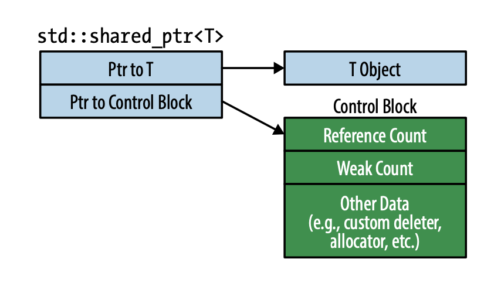

### Item 19: Use **std::shared_ptr** for shared-ownership resource management 


#### Overall
- **std::shared_ptr** offers convenience approaching that of garbage collection for the shared lifetime management of arbitrary resources.
- Compared to **std::unique_ptr**, **std::shared_ptr** objects are typically twice as big, incur overhead for control blocks, and require atomic reference count manipulations.
- Default resource destruction is via **delete**, but custom deleters are supported. The type of the deleter has no effect on the type of the **std::shared_ptr**.
- Avoid creating **std::shared_ptrs** from variable of raw pointer type.

**std::shared_ptr** is another smart pointer in C++11 that supports the resource management of shared-ownership object. It comes with the reference count. When the reference count drops to zero, i.e. no more pointering to the object, the last **std::shared_ptr** will release the resources in destructor. 

Such mechanism has several performance implications:

+ **std::shared_ptr**s are twice the size of a raw pointer.
+ Memory for the reference count must be dynamically allocated.
+ Increments and decrements of the reference count must be atomic.

Recall from last Item 18, we mention that **std::unique_ptr** could easily be converted to **std::shared_ptr**. However, this is just one-way conversion. You cannot easily cast a **std::shared_ptr** back to **std::unique_ptr**, even if the reference count is 1.

Why? It's about the **control block**. What is this?



From the illustration above, we could see that a control block contains the reference count, weak count and extra functional pointers to custom deleter, allocator, etc. This implies that customer deleter will not increase the size of the **std::shared_ptr** itself, which is the contrary case in **std::unique_ptr**. The control block is conceptually one per object managed.

But when should a control block be generated or to reuse an existing control block? Here are the rules:

1. **std::make_shared** always create a control block
2. A control block is created when a **std::shared_ptr** is constructed from a unique-ownership pointer. (i.e. **std::unique_ptr** or **std::auto_ptr**)
3. When a **std::shared_ptr** constructor is called with a raw pointer, it creates a control block.

With regard to the 3rd point here, it's generally not recommended to create **std::shared_ptr** with a raw pointer, which might lead to multiple creation of control blocks and thus multiple deletion. Consider this bad example:

```CPP
auto pw = new Widget;
...
std::shared_ptr<Widget> spw1(pw, loggingDel);	// create 1st control block for pw
...
std::shared_ptr<Widget> spwd2(pw, loggingDel);	// create 2nd control block for pw
...
// double deletion once out of scope, bad!
```
Instead, if you really cannot use **std::make_shared** to create **std::shared_ptr** (for example when you need to pass in custom deleter), prefer the direct use of `new`:

```CPP
std::shared_ptr<Widget> spw1(new Widget, loggingDel);	// create 1st control block for Widget
...
std::shared_ptr<Widget> spw2 = spw1;	// OK
```

Another dangerous use case is the `this` pointer. Suppose we have the following seemingly good class:

```CPP
std::vector<std::shared_ptr<Widget>> processedWidgets;

class Widget {
public:
  ...
  void process();
  ...
};

void Widget::process() {
  ...	
  // process the Widget
  ...
  processedWidgets.emplace_back(this);	// add this to a list of processed Widgets
  // this is wrong!
}
```

We have a global variable `processedWidgets` which is a vector of **std::shared_ptr** for `Widget`, and each time we finish processing the `Widget`, we add it into this global variable. 

Let me go straight into the problem here: we double-create the control block when emplacing back `this` pointer into the global variable. `this` is a raw pointer and you can refer to the 3rd rule for when will a new control block be created.

The **std::shared_ptr** API includes a facility for just this kind of situation: A template class **std::enable_shared_from_this\<T\>** and a `shared_from_this` function. Therefore, the correct way to achieve the above functionality is as follows:

```CPP
class Widget: public std::enable_shared_from_this<Widget> {
public:
  ...
  void process();
  ...
};

void Widget::process() {
  // as before, process Widget
  ...
  // add std::shared_ptr of current object to global store
  processedWidgets.emplace_back(shared_from_this());
}
```

Two last points here are that, **std::shared_ptr** does not support the resource management of an array, although such usage is discouraged even in technically-allowed case as in **std::unique_ptr**. And even if you provide a custom deleter to **std::shared_ptr**, it doesn't appear on its type. Therefore we can pack into a vector of **std::shard_ptr**s with different deleters of the same type **T**.