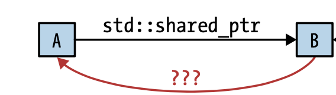

### Item 20: Use **std::weak_ptr** for **std::shared_ptr**-like pointers that can dangle 


#### Overall
- Use **std::weak_ptr** for **std::shared_ptr**-like pointers that can dangle.
- Potential use cases for **std::weak_ptr** include caching, observer lists, and the prevention of **std::shared_ptr** cycles.

**std::weak_ptr** is an augmentation of **std::shared_ptr**. It doesn't participate in the shared ownership reference counting, and can not be dereferenced.

**std::weak_ptr** is typically created out of **std::shared_ptr**, and we can use `expired()` function to test if the object pointed is still valid, and if so `lock()` will return a **std::shared_ptr** of that object for manipulation.

```CPP
auto spw = std::make_shared<Widget>();	// reference count is 1
...
std::weak_ptr<Widget> wpw(spw);		// reference count is still 1
...
spw = nullptr;				// reference count drops to 0
					// object destroyed
...
if (wpw.expired()) {
  // if wpw doesn't point to an object
}
...
// if wpw's expired, spw1 is null
// otherwise gives back a shared_ptr for manipulation
std::shared_ptr<Widget> spw1 = wpw.lock();
...
// if wpw's expired
// throws std::bad_weak_ptr exception
std::shared_ptr<Widget> spw2(wpw);
```

There are three main usages of a **std::weak_ptr**:

1. Caching

We might want to store some computation results in cache, but also need to keep an eye on if that result has expired and thus needs re-computation.

```CPP
std::shared_ptr<const Widget> fastLoadWidget(WidgetID id) {
  static std::unordered_map<WidgetID, std::weak_ptr<const Widget>> cache;

  auto objPtr = cache[id].lock();

  if (!objPtr) {	
    // not in cache, load it, cache it
    objPtr = loadWidget(id);
    cache[id] = objPtr;
  }
  return objPtr;
}
```

2. Observer design pattern

In the observer design patter, there are **subjects** who are observed by **observers**. Each subject holds pointers to its observers, so that if its state changes, it could send updates to its observers. But it must make sure that if an observer gets destroyed, subject doesn't try to subsequently access it. **std::weak_ptr** is the right type of pointer to use here.

3. Cycle pointers

Suppose there is a use case that **A** holds a **std::shared_ptr** of **B**, but **B** also want to point back to **A**. As illustrated in below:



**raw pointer** is a bad choice because if **A** is destroyed, B may inadvertently dereference the dangling pointer.

**std::shared_ptr** is also a bad choice, because if **A** goes out of scope, it cannot be destroyed because **B** is still keeping a reference count for it.

Therefore, **std::weak_ptr** is the way to go in this case.