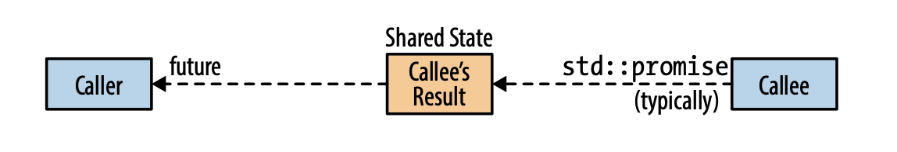

### Item 38: Be aware of varying thread handle destructor

#### Overall
- Future destructors normally just destroy the future's data members.
- The final future referring to a shared state for a non-deferred task launched via **std::async** blocks until the task completes.

In last item, we talk about that if you don't explicitly join or detach a **std::thread**, upon destruction it will cause the program termination. **std::async** is another thread handler, but it behaves differently. It never causes program termination.

How is the **std::future** and **std:promise** stored? It cannot be stored locally on the **callee** side, since the thread will be closed when it finishes the task. It should also not be stored on the **caller** side, because there are **shared_future** which should live as long as the last reference dies.

Therefore, as we can see from the graph above, there is actually a **shared state** stored in middle, typically on the heap. This explains the behavior of the destructor of **std::future**:

+ **the destructor for the last future referring to a shared state for a non-deferred task launched via std::async blocks**
+ **the destructor for all other futures simply destroys the future object**

Normally, a future's destructor destroys the future object. The exception to this normal behavior arises only if all the following apply:

1. it refers to a shared state that was created due to a call to **std:async**
2. the task's launch policy is **std::launch::async**
3. the future is the last future referring to the shared state

Only when all of these conditions are fulfilled does a future's destructor behave differently, that is, to block until the asynchronously running task completes. Pratically this amounts to an implicit `join` with the thread running the **std::async**-created task.