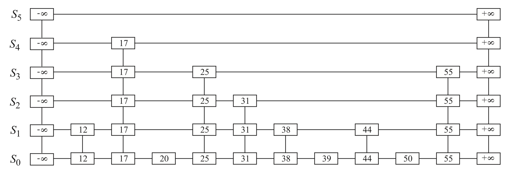
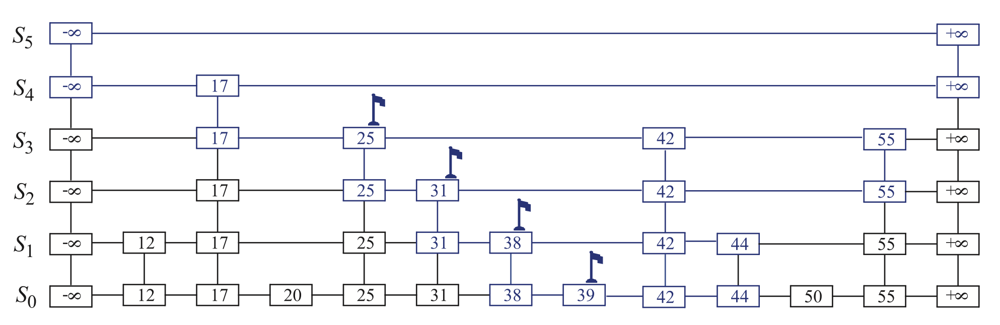

### Design a Key-Value Store based on SkipList

Key-Value store is an integral parts for many real-world giant industry applications. It provides fast access, insert and delete operations. 

In the project, we aim to build a simple Key-Value Store using SkipList. The famous **[Redis](https://github.com/redis/redis)** database is implemented using SkipList as well.

The contents:
+ Abstract Data Structure **SkipList**
+ C++ Implementation of **SkipList**
+ Performance Testing and Optimization
+ Future Works

---

#### What is a **SkipList**?

(Reference: <[Data Structures & Algorithms in C++](https://www.amazon.com/Data-Structures-Algorithms-Michael-Goodrich/dp/0470383275)> by Michael T. Goodrich, Roberto Tamassia, David Mount)

**SkipList** realizes an ordered map functionality by making random choice in arranging the entries. It supports ***O(logn)*** search and update times on average.

The entries in SkipList is ordered in such a way that there will be `h` levels. The bottom level `h0` contains all the entries in sorted way. Each level above would contain a subset of entries in the level below it, also in a sorted way. A basic overview of a sample SkipList is illustrated below:



The SkipList will support three main APIs: `Search`, `Insert` and `Delete`. We will walk through each algorithm below:

(We will denote ***s*** the start position of the SkipList, a top-left position with key = `-oo`, ***n*** the number of entries in the SkipList)

##### Search 

```text
Algorithm SkipSearch(k):
  Time Complexity: O(logn)
  Input: A search key k
  Output: Position p in the bottom list h0 such that the entry at p 
          has the largest key less than or equal to k

  p <- s
  while (below(p) != null) do
    p <- below 		// go down one level
    while (k >= key(after(p)) do
      p <- after(p)	// go right as far as possible
  return p
```

The above algorithm is actually pretty simple. Starting from the top level, you go right as far as possible, and go down one level to continue try going right. 

In the end, we will end up with a position of key <= k. If the key = k, it indicates that we find the key.

##### Insert

```text
Algorithm SkipInsert(k, v):
  Time Complexity: O(logn)
  Input: Key k and value v
  Output: Topmost position of the entry inserted in the skip list

  p <- SkipSearch(k)
  q <- null
  e <- (k, v)
  i <- -1
  repeat
    i <- i + 1
    if i >= h then				// add a new level to the skip list: -oo -> +oo
      h <- h + 1
      t <- after(s)
      s <- InsertAfterAbove(null, s, (-oo, null))
      InsertAfterAbove(s, t, (+oo, null))
    while (above(p) = null) do 
      p <- before(p)
    p <- above(p)
    q <- InsertAfterAbove(p, q, e)		// add a position in the tower of the new entry
  until coinFlip() = tails
  n <- n + 1
  return q
```

The above algorithm might look a bit complex. Let's break it down. We will start by utilizing the `SkipSearch` algorithm we introduce before to find in the bottom `h0` level the biggest key that's smaller than k. We will insert the new key value pair `(k, v)` after this position and move upward.

There is a utility function called `InsertAfterAbove(after, above, (k,v))` to help insertion. We use randomization technique here that we will replicate the new `(k,v)` pair upward for some level `i` depends on coin flip. If we exceed the current height of the SkipList, we will construct a new level with only two positions on that level: `(-oo, null) -> (+oo, null)`, basically just two placeholders.

A sample insertion of key `42` illustration is as below. The key position before `42` is highlighted.



##### Remove

```text
Algorithm SkipRemove(k):
  Time Complexity: O(logn)
  Input: Key k
  Output: True if deletion is successful, False otherwise

  p <- SkipSearch(k)
  if p.key != k then			// key doesn't exist
    return False
  while (p != null) do
    tmp <- above(p)
    connect before(p) and after(p)	// shrink the link
    delete p
    p <- tmp				// going upward to delete all entries of key k
  return True
```

The removal algorithm is pretty straight-forward and easy. We just delete the whole vertical tower containing key `k`, if any.

##### Analysis

We roughly say that **SkipList**'s 3 main APIs is ***O(logn)*** in time complexity. The proof of this fact is a bit involved mathematically. We refer interested readers to the section "**9.4.2 A Probabilistic Analysis of Skip Lists**" of the reference book mentioned at beginnin.

---

