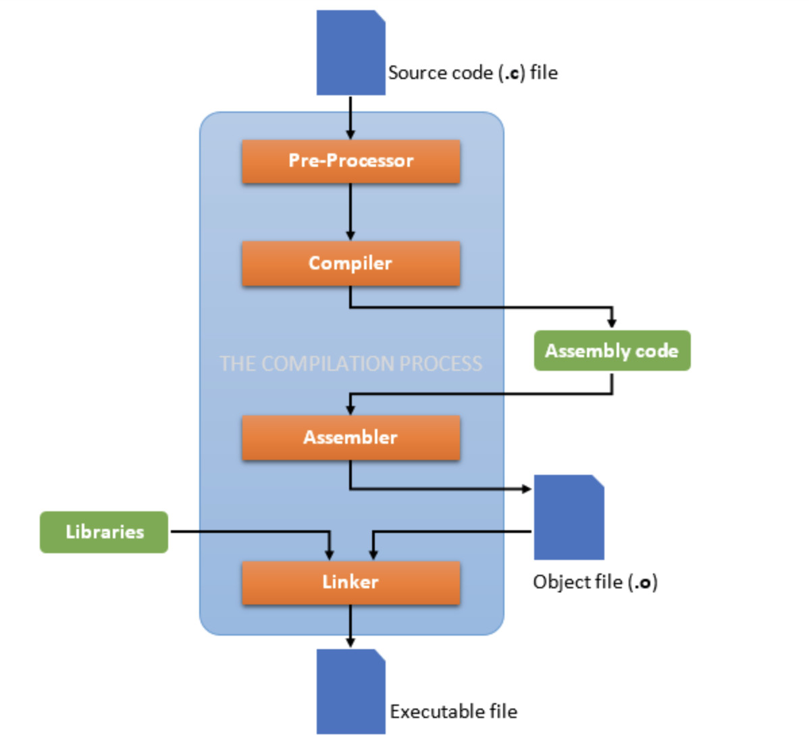

## Quick Tutorial of Makefile


#### Why Makefile?

When we are only working on a tiny project with only one source code files, it might be quite easy and convenient to type in the compilation rules in the terminal everytime we want to build the project.

However, as the project grows, more and more source files get added into the project, it becomes hard to maintain the build rules, the dependencies and time-consuming to type in a long sequence of compile commands.

Here comes the `Makefile` for help. The Makefile is a text file that contains the recipe for building our program. It aims to automate the compilation process for small to medium size of projects. Some advantages of using make instead of mannual compilation includes:

+ It automates the process, no need to worry about specification and dependency.
+ The program is more portable and easier to distribute and build across teams.

#### How does Compilation Work?



To better understand how a program is compiled and executed by the computer, we need to be clear on how the compiler works.

Typically, when people talk about compilers like `GCC` or `G++`, they are actually a set of compliation tools.

A source code file would go through the following steps to be executable:

1. the source code file (**.c** or **.cpp** file) would go through the `preprocesser` to expand any macros defined and include the headers imported.
2. the compiler turns the source code file into assembly code (**.s** file).
3. the assemblyer turns the assembly file into object file (**.o** file).
4. the linker links library and object files into the final **executable** file.

#### How to Write Makefile?

Then, how do we make a `Makefile` and enjoy the benefits it could bring about? In the following section, we will make up a sample C++ project to demonstrates how to write a basic `Makefile`.

This sample borrows many knowledge from the one lecture at **Carnegie Mellon University** [15213: Introduction to Computer System](https://www.cs.cmu.edu/~213/). The slide is available [here](https://www.cs.cmu.edu/afs/cs/academic/class/15213-s22/www/bootcamps/lab3_slides.pdf) if readers are interested.

Firstly, we write some sample classes for demonstration:

```CPP
// in adder.h
extern int secret;

class Adder {
public:
    explicit Adder(int x) noexcept;
    
    int add(int y) noexcept;
private:
    int secret_number;
};
```

```CPP
// in adder.cpp
#include <iostream>
#include "adder.h"

int secret = 10;

Adder::Adder(int x) noexcept : secret_number(x) {
    std::cout << "Adder: I got a secret number" << std::endl;
}

int Adder::add(int y) noexcept {
    return secret_number + y;
}
```
```CPP
// in guesser.cpp
#include <iostream>
#include "adder.h"

using namespace std;

int main() {
    Adder a(secret);
    int input, result, guess;
    cout << "Enter a number please: ";
    cin >> input;
    result = a.add(input);
    guess = result - input;
    cout << "I guess the secret key is " << guess << endl;
    return 0;
}
```

Here we put the declaration and defintion of a class called `Adder` in `adder.h` and `adder.cpp` respectively, and the main function in `guesser.cpp` relies on the `Adder` class.

If we just want to compile it in the terminal, the command line argument would be something close to

```console
g++ -std=c++11 -o guesser guesser.cpp adder.cpp
```

Now we will write a basic `MakeFile` to automate the compilation process.

Firstly, we need to define the compiler tool and flags to be passed in:

```text
# Compiler, g++ for C++ program and gcc for C program
CC = g++

#   We provide the following Flags
# 	optimization level 0
# 	debugger
# 	turn all optional warnings
# 	turn all warnings into errors
# 	set standard c++ to c11
CFLAGS = -O0 -g -Wall -Werror -std=c++11
```

Next, we will define the **default target** to build, essentially when you only type ``make`` in the terminal without any target specification, this is the default target to be built.

```text
# default target when we only type "make"
all: guesser
	@echo "We compile the guesser!"
```

Now, we need to also define the dependency in compilation. We could do it step-by-step, or just one step in a concise manner. We will first show the step-by-step process:

```text
# the followings are step-by-step compilation process
# actually we can do that in one step, see further below

# create adder.s file from adder.cpp and adder.h
adder.s: adder.cpp
	$(CC) $(CFLAGS) -S adder.cpp -o adder.s

# create guesser.s file from guesser.cpp
guesser.s: guesser.cpp
	$(CC) $(CFLAGS) -S guesser.cpp -o guesser.s
	
# create adder.o file from adder.s
adder.o: adder.s
	$(CC) $(CFLAGS) -c adder.s -o adder.o

# create guesser.o file from guesser.s
guesser.o: guesser.s
	$(CC) $(CFLAGS) -c guesser.s -o guesser.o

# create the step-by-step final executable guesser-stepwise
guesser-stepwise: guesser.o adder.o
	$(CC) $(CFLAGS) -o guesser-stepwise guesser.o adder.o
```

The above section could actually be simplied to just one command. Notice here the target `guesser` corresponds to the default `all` target:

```text
# Concise one-step compilation rule
# it combines all the assembly + compiler step we did above
guesser: adder.cpp guesser.cpp adder.h
	$(CC) $(CFLAGS) -o guesser adder.cpp guesser.cpp
```

Finally, we will define one extra target `clean`. By using the `.PHONY` command, it will be invoked when you type `make clean` in the terminal.

```text
# clean up command
.PHONY: clean
clean:
	# remove all the files with extension .o or .s and the guesser executable
	rm -f guesser *.o *.s
```

#### How to use Makefile?

Now that we have the basic `Makefile` constructed, we could move to the base directory for this project, i.e.

```text
./Makefile-tutorial
	- adder.h
	- adder.cpp
	- guesser.cpp
	- Fig
	- Makefile
	- README.md	
```

we can type in the terminal the following command to build:

```text
// the followin three commands are equivalent in our case
make -f Makefile
make -f Makefile all
make -f Makefile guesser
```

After the build up, we could clean up the space by executing

```text
make -f Makefile clean
```